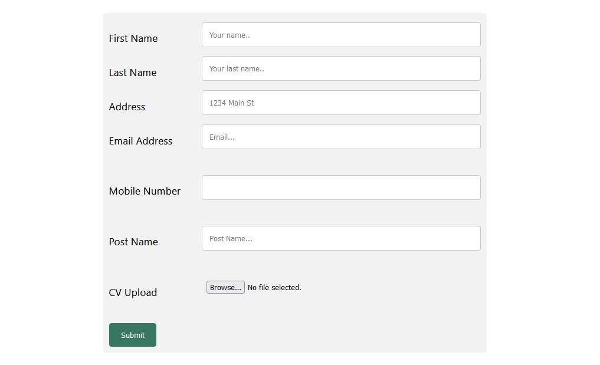
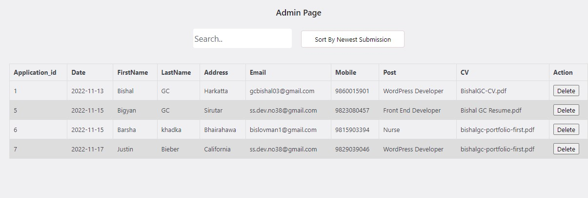
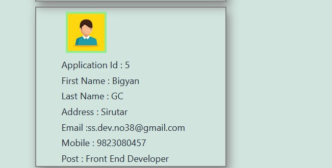

<h1>Simple plugin for job application</h1>

Author Name : <a href="https://bishalgc.com/">Bishal GC</a>

Software Engineer 

Sirutar,Bhaktapur,Nepal

Email id: gcbishal03@gmail.com

Whatsapp/Viber : +977-9860015901

<h2>Features</h2>

1) Collect job applicants data from the form.
2) Quickly show the applicant in frontend through widget.
3) Admin features to search,sort and delete the entry.
4) Email send confirmation after successfully submitting form.

<h2>Screenshots</h2>

<h3>FrontEnd</h3>

<h3>Admin</h3>

<h3>Widet</h3>

